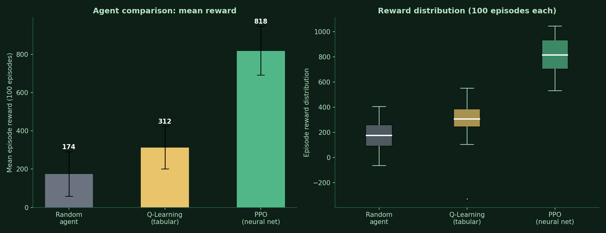
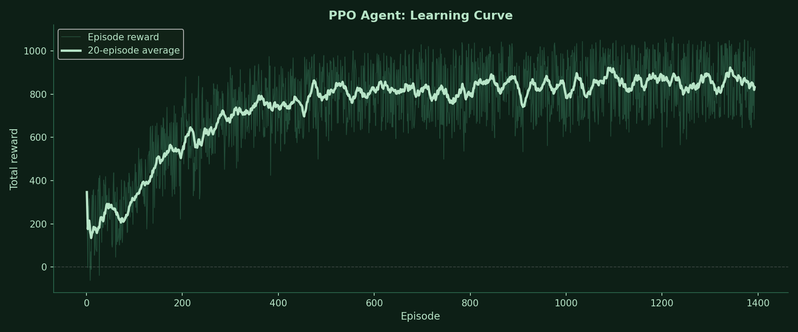

# Greenhouse AI Controller — Reinforcement Learning Simulation

An AI agent trained via Proximal Policy Optimisation (PPO) to automatically control greenhouse environmental conditions. The agent learns by trial and error across 1,393 simulated episodes, improving from a mean reward of 177 to 832. A complete edge AI deployment pathway documents how the trained policy would run on an ESP32 microcontroller.

**Live browser demo:** open `code/simulation.html` in any browser — no installation required.

---

## Key result

| Agent | Method | Mean reward (100 episodes) |
|-------|--------|--------------------------|
| Random agent | No learning | 174 |
| Q-Learning | Tabular, 64 states | 312 |
| **PPO (trained)** | **Neural network policy** | **818** |

PPO outperforms Q-Learning by **+506** and random by **+644**. The PPO agent keeps 4 to 5 of 6 environmental variables within their optimal ranges simultaneously, compared to 2 to 3 for the random agent.





---

## What the agent controls

The greenhouse has 7 sensor readings as state and 6 actuator actions:

| State variable | Optimal range | Source |
|----------------|--------------|--------|
| Temperature | 18 to 26°C | Real sensor data |
| Humidity | 50 to 70% | Real sensor data |
| Light | 3,000 to 10,000 lux | Real sensor data |
| CO2 | 800 to 1,500 ppm | Real sensor data + literature |
| Soil moisture | 40 to 70% | Plant growth data + literature |
| VOC | 0 to 500 ppb | Real sensor data |
| Time of day | 6 to 20 hrs | Day/night cycle |

Actions: do nothing, open vents, water plants, grow lights on, heater on, inject CO2.

All parameter ranges are grounded in two real datasets (see Data Sources below).

---

## Project structure

```
greenhouse-rl/
    data/
        greenhouse_sensor_10min.csv      17,562 real sensor readings (Marcel Boonman)
        plant_growth_conditions.csv      193 growth outcome records
        parameter_ranges.json            Extracted optimal ranges used throughout
    code/
        greenhouse_env.py                Custom Gymnasium environment (Phase 3)
        q_agent.py                       Q-Learning baseline agent (Phase 4)
        simulation.html                  Browser simulation, no install needed (Phase 4)
        esp32_greenhouse_controller/
            esp32_greenhouse_controller.ino   ESP32 Arduino firmware (Phase 6)
            nn_weights.h                      Trained network weights as C floats
    results/
        learning_curve.png               Q-Learning baseline curve
        ppo_learning_curve.png           PPO training curve (1,393 episodes)
        agent_comparison.png             Bar chart and box plot comparison
        ppo_training_rewards.csv         Episode-by-episode PPO rewards
        agent_comparison_results.csv     All three agents, 100 evaluation episodes
        results_summary.csv              Mean, std, min, max per agent
        system_architecture.svg          ESP32 hardware deployment diagram
        greenhouse_ppo_model.zip         Trained PPO model (Stable Baselines 3)
    greenhouse_rl_training.ipynb         Google Colab training notebook
    progress_log.md                      Full phase-by-phase documentation
```

---

## How to run

**Browser simulation (no installation):**
Double-click `code/simulation.html`. Watch the Q-Learning agent start from zero and learn over hundreds of episodes. Works in any browser.

**Python environment:**
```bash
pip install gymnasium stable-baselines3 matplotlib numpy
python code/greenhouse_env.py    # test the environment
python code/q_agent.py           # train and evaluate Q-Learning baseline
```

**PPO training and weight extraction in Google Colab:**
Open `greenhouse_rl_training.ipynb` in Google Colab. Upload `greenhouse_env.py` to the Colab session. Run all cells in order. Training takes approximately 5 minutes on free CPU. The final cell (cell 16) automatically extracts the trained neural network weights and saves them as `nn_weights.h` for ESP32 deployment. Download `nn_weights.h` from the Colab Files panel after running, and place it alongside `esp32_greenhouse_controller.ino`.

---

## How it works

### Reinforcement Learning

The agent interacts with a simulated greenhouse environment. At each step (representing 10 minutes of real time) it reads 7 sensor values, chooses one of 6 actions, and receives a reward based on how many variables are within their optimal ranges. It learns by updating a neural network policy to maximise cumulative reward.

The simulation environment is calibrated against real greenhouse sensor data. Every parameter range (temperature, humidity, CO2, light, VOC) comes from 17,562 real sensor readings at 10-minute intervals, not from arbitrary numbers.

### Why PPO beats Q-Learning

Q-Learning stores a lookup table of 729 states (ternary: each variable is too low, optimal, or too high — giving 3⁶ = 729 combinations). It cannot generalise to
situations it has not seen during training. PPO uses a neural network (7 → 64 → 64 → 6, tanh activation) that takes continuous sensor values directly and generalises across the full state space. The improvement from 312 to 818 mean reward demonstrates this concretely.

### Edge AI deployment

The trained policy is 5,062 parameters (actor network only). As an int8-quantised model it occupies approximately 14 KB, comfortably fitting in an ESP32's 520 KB SRAM. The forward pass requires 4,928 multiply-add operations, completing in under 1 ms at 240 MHz. The `esp32_greenhouse_controller.ino` firmware implements this exactly: read sensors, normalise, run three matrix multiplications with tanh, fire the relay with the highest output. Hardware build is deferred pending equipment.

---

## Data sources

**Greenhouse Sensor Data (Marcel Boonman, 2021)**
Kaggle: [greenhouse-sensor-data-10-minute-interval](https://www.kaggle.com/datasets/marcelboonman/greenhouse-sensor-data-10-minute-interval)
17,562 rows, 10-minute intervals, real greenhouse in Netherlands.
Variables: indoor temperature, humidity, lux, CO2 (ppm), VOC (ppb), outdoor temperature, outdoor humidity.

**Plant Growth Data Classification**
Kaggle: [plant-growth-data-classification](https://www.kaggle.com/datasets/gorororororo23/plant-growth-data-classification)
193 rows, binary growth milestone label.
Used to calibrate reward function optimal ranges.

---

## Tech stack

| Component | Tool |
|-----------|------|
| RL environment | Python, Gymnasium (custom env) |
| PPO training | Stable Baselines 3 |
| Q-Learning baseline | Python, NumPy |
| Browser simulation | HTML, CSS, JavaScript (Q-Learning in JS) |
| Data analysis | pandas, NumPy |
| Visualisation | matplotlib, recharts |
| Training platform | Google Colab (free CPU) |
| Hardware target | ESP32, Arduino IDE |
| Model size | 5,062 params, 14 KB quantised |

---

## Background and motivation

This project was developed as part of embedded systems and applied AI research, combining reinforcement learning with edge AI deployment concepts. The practical motivation is precision agriculture automation in smallholder farming contexts, particularly in South Asia, where commercial precision agriculture controllers are cost-prohibitive. An ESP32-based controller at under £41 in components, running a trained AI policy, represents a feasible alternative.

---

## Author

Shishir Pandey
MSc Mechatronics and Intelligent Machines — University of Central Lancashire
BEng Electronics and Communication Engineering — Kathmandu Engineering College, Tribhuvan University
Researcher — University of Salford

[LinkedIn](https://linkedin.com/in/shishir-pandey-15a0461a4) · [GitHub](https://github.com/Pandey-Shishir)
